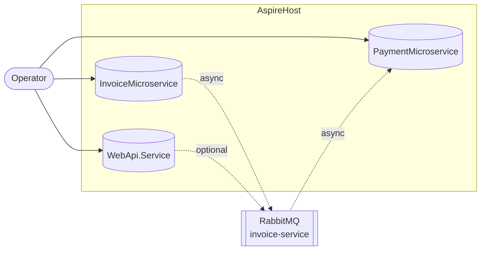
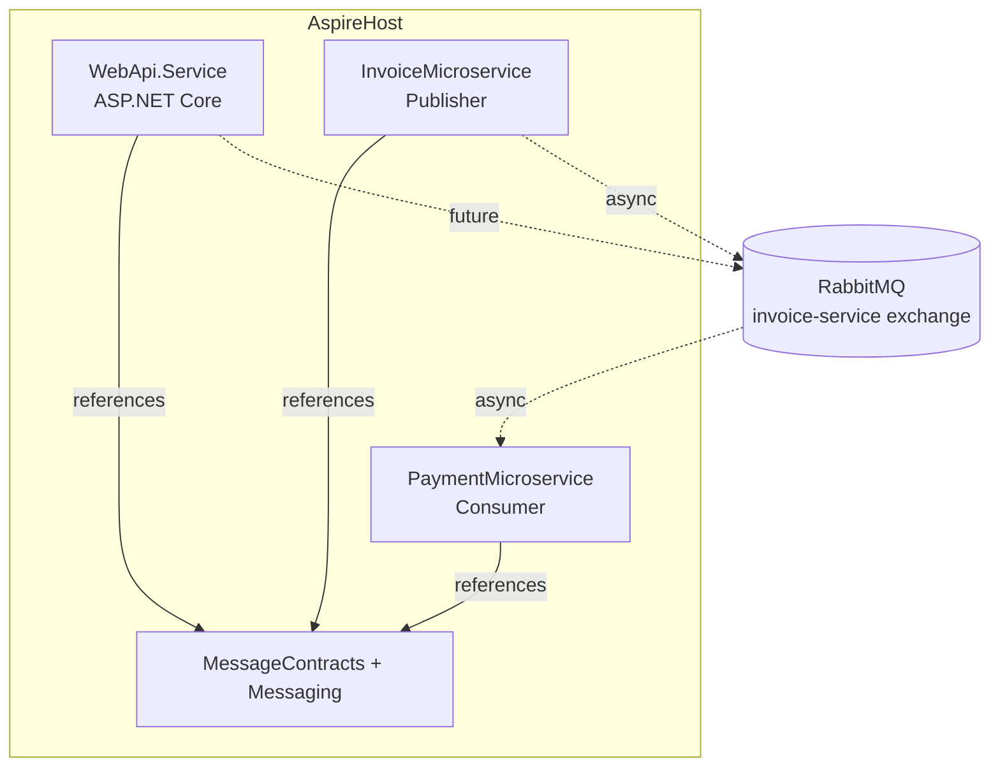

# AspireProject

Modern .NET Aspire sample that wires together an API gateway, an invoice producer, and a payment consumer via RabbitMQ, complete with reusable messaging abstractions, tests, and helper scripts for local and containerized runs.

## Repository Layout

- `AppHost/AppHost` – Aspire distributed app host that orchestrates the Web API plus invoice and payment microservices.
- `AppHost/WebApi.Service` (+ `tests/WebApi.Service.Tests`) – ASP.NET Core 10 API that exposes the sample `/WeatherForecast` endpoint and ships with NUnit integration tests.
- `AppHost/InvoiceMicroservice` – Console worker that creates fake invoices interactively and publishes `InvoiceCreated` events via MassTransit and RabbitMQ.
- `AppHost/PaymentMicroservice` – Worker that subscribes to the invoices exchange/queue and logs (or processes) each invoice.
- `AppHost/MessageContracts` – Shared POCO contracts for invoices plus the `Message` base type.
- `AppHost/Messaging` – Thin abstractions (`IMessageProducer<T>`, `IMessageHandler<T>`) shared by producers/consumers.
- `AppHost/tests/...` – NUnit suites for both microservices, covering unit- and RabbitMQ-backed integration cases.
- `run-services.sh|.ps1`, `start-docker-instances.sh` – Developer tooling to build/run the solution or its containers.

## Solution Topology


### Context Diagram



### Container Diagram



Editable Excalidraw source for these diagrams lives at `C:\Git\Untitled-2025-11-13-2006.excalidraw`.

## Core Scenarios (“Cases”)

1. **Invoice creation & publishing** – The `InvoiceMicroservice` (`AppHost/InvoiceMicroservice/Program.cs`) reads RabbitMQ settings (appsettings or `RABBIT_HOST`) and waits for keyboard input. Each keystroke (except `q`) generates deterministic-but-random invoices and publishes them via `IMessageProducer<InvoiceCreated>`, ensuring traceable IDs and sample line items for downstream consumers.
2. **Payment ingestion & handling** – `PaymentMicroservice` (`AppHost/PaymentMicroservice/Program.cs`) configures MassTransit with an `InvoiceCreatedConsumer`. It binds the `payment-microservice` queue to the `invoice-service` exchange (default `fanout`), delivering events to the reusable `IMessageHandler<InvoiceCreated>` which currently logs but can be swapped for real payment logic or orchestrated retry workflows.
3. **Web API experience & observability** – `WebApi.Service` exposes `/WeatherForecast` and hosts Swagger UI at `/swagger`, acting as a placeholder gateway while showcasing Aspire-provided telemetry, discovery, and resilience features once the API references the `Project.Aspire` defaults.

Each scenario has supporting tests:
- `AppHost/tests/InvoiceMicroservice.Tests` validates producer behavior plus RabbitMQ publishing.
- `AppHost/tests/PaymentMicroservice.Tests` checks consumer delegation and end-to-end queue handling.
- `AppHost/tests/WebApi.Service.Tests` verifies the API returns five forecasts with valid data.

## Running the Stack Locally

1. **Start RabbitMQ (Unix example)**  
   ```bash
   docker run -d --name rabbitmq \
     -p 5672:5672 \
     -p 15672:15672 \
     rabbitmq:3-management
   ```
   Management UI becomes available at `http://localhost:15672` (`guest/guest`).

2. **Build everything**  
   ```bash
   cd AppHost
   dotnet build AppHost.slnx
   ```

3. **Run services quickly**  
   - **Aspire host**: `dotnet run --project AppHost/AppHost/AppHost.csproj` (launches all three services with Aspire dashboards when enabled).
   - **Windows**: `./run-services.ps1 -InvoiceInstances 1 -PaymentInstances 3 -RabbitHost localhost`
   - **Unix/macOS**: `./run-services.sh --paymentInstances 3 --rabbitHost localhost`

   Scripts compile the solution, then launch invoice & payment workers (multiple instances supported). Alternatively, run each project manually:
   ```bash
   cd AppHost/InvoiceMicroservice && dotnet run
   # separate terminal
   cd AppHost/PaymentMicroservice && dotnet run
   # API
   cd AppHost/WebApi.Service && dotnet run
   ```

4. **Dockerized microservices** (expects a RabbitMQ endpoint reachable via `host.docker.internal`):  
   ```bash
   ./start-docker-instances.sh InvoiceCount 1 PaymentCount 2
   ```
   The script removes old containers, starts new detached instances, and maps the host gateway automatically.

## Testing

From `AppHost`:
```bash
dotnet test AppHost.slnx
```
This runs the API, producer, and consumer test suites. Integration tests communicate with whatever RabbitMQ endpoint is configured in `tests/*/appsettings.json` (defaults to `localhost`), so ensure the broker is running first.

## Extending the Architecture

- **Deepen Aspire integration**: configure per-service resources (RabbitMQ container, dashboards, secrets) or add health checks so Aspire’s environment view reflects production topology.
- **Enhance message handling**: replace the logging-only `MessageHandler<T>` with richer business logic, validation, and error handling policies.
- **Add API endpoints**: expose invoice/payment status via `WebApi.Service`, using the shared contracts to keep REST + messaging synchronized.

These improvements can build directly on the existing contracts, MassTransit setup, and testing harness already in place.
